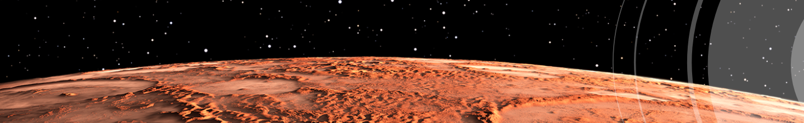

# Mission-to-Mars
## Project Overview
- This analysis project provides a visualizatoin of web scraping for the purpose of showcasing up-to-date data (latest news, featured image, table of Mars facts, and images of Mar's hemispheres) about Mars. 
    -  Python, Flask, MongoDb, and HTML were utilzed in this project.
